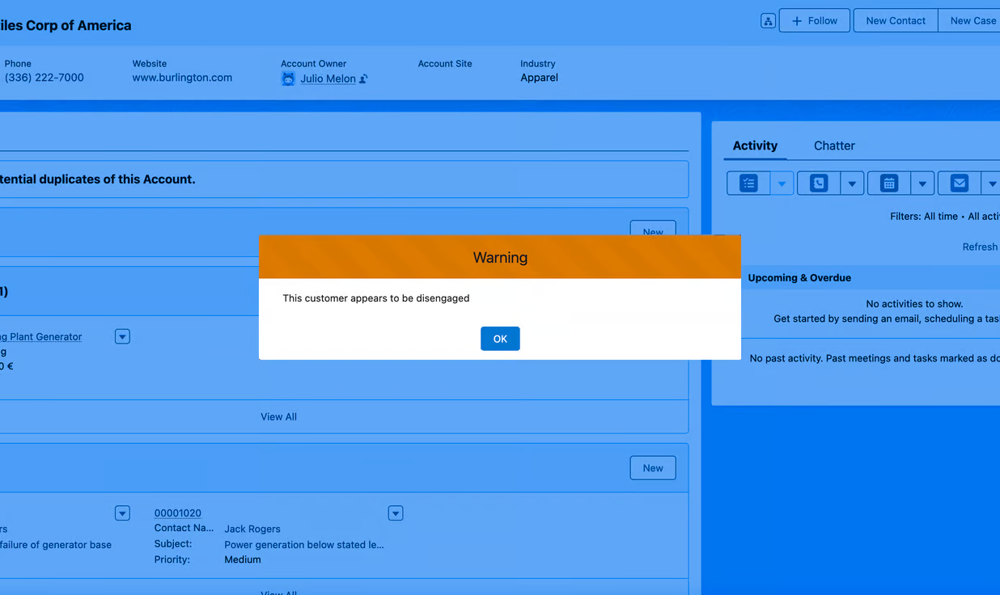
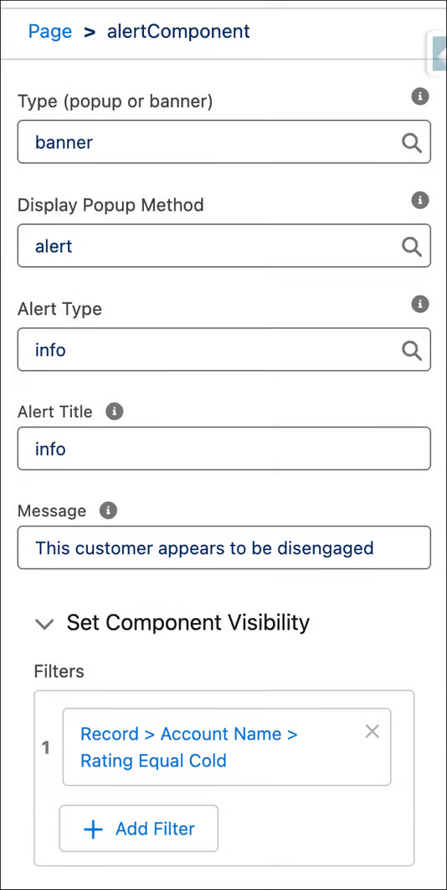
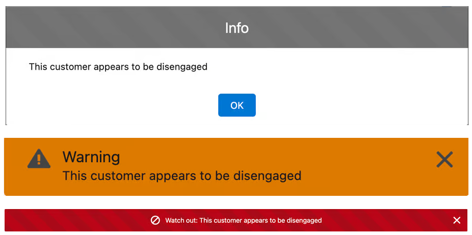

# Alert Component

## Overview

Although Salesforce will release a functionality in the Summer ’25 release to generate alerts with the option to discard records, in the meantime, this LWC notifies users about record statuses. This Alert Component is a practical Lightning Web Component designed to enhance user notifications within Salesforce. It supports different display methods (popup, banner) and alert types (warning, error, info), making it suitable for a wide range of use cases.

## Installation

1. Clone the repository or download the zip file.
2. Deploy the alertComponent LWC to your Salesforce org.
3. Place the component in the desired Lightning page. 
4. Configure the properties to customize the alert behavior and the component visibility to filter when the message should be shown

## Alert Types

- Toast
- SLDS alert banner
- Lightning-alert

